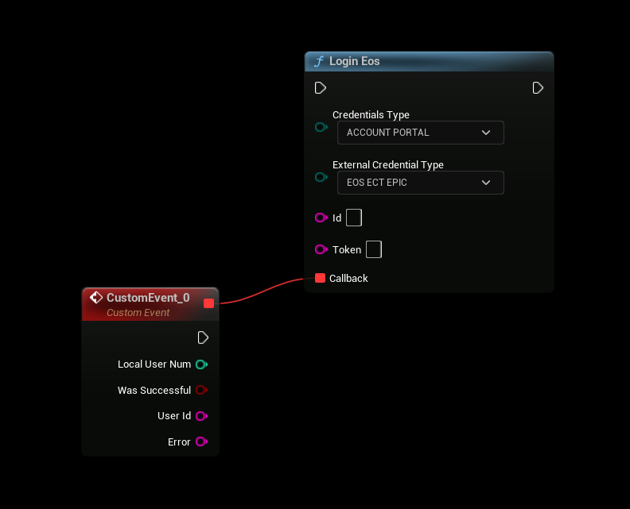

# Account Portal
The EOSCore Lite plugin for Unreal Engine simplifies integration with Epic Online Services (EOS) SDK, including user authentication via the Account Portal method. This summary outlines the process for authenticating users with the Account Portal using the `LoginEos` function.

## Prerequisites
- EOSCore Lite plugin installed and enabled
- Unreal Engine 5.6 (more versions will be added during plugin development)

## Overview
The Account Portal authentication method allows users to log in using their Epic Games credentials through an Epic Games overlay or a browser window. This method uses the `EOS_Auth_Login` API under the hood, configured for Epic Account authentication.

## Authentication Process
1. **Set Up EOSCore Plugin**:
   - Ensure the EOSCore Lite plugin is installed and enabled in your Unreal Engine project.
   - Configure the plugin with your Epic Games product ID and client credentials in the project settings.

2. **Configure Login Parameters**:
   - Use the `LoginEos` function provided by the EOSCore plugin.
   - Set the **Credentials Type** to `Account Portal`.
   - Set the **External Credential Type** to `Epic` to specify Epic Games account authentication.

3. **Initiate Login**:
- Call the `LoginEos` function from your Blueprint or C++ code.
- Example in Blueprints:
    - Create a node for `LoginEos`.
    - Set `Credentials Type` to `AccountPortal`.
    - Set `External Credential Type` to `Epic`.

4. **User Authentication**:
   - If the EOS overlay is enabled in the plugin settings, the Epic Games login overlay will appear for the user to enter their credentials.
   - If the overlay is disabled, a browser window will open, directing the user to the Epic Games login page for authentication.

5. **Handle Callback**:
   - The `LoginEos` function triggers a callback upon completion, indicating success or failure.
   - On success, the callback provides an access token for subsequent EOS API calls and session management.
   - On failure, the callback returns an error code (e.g., `EOS_Auth_InvalidToken`, `EOS_Auth_UserNotFound`) to handle issues like invalid credentials or network errors.
   - In Blueprints, connect the callback to a custom event to process the result.
