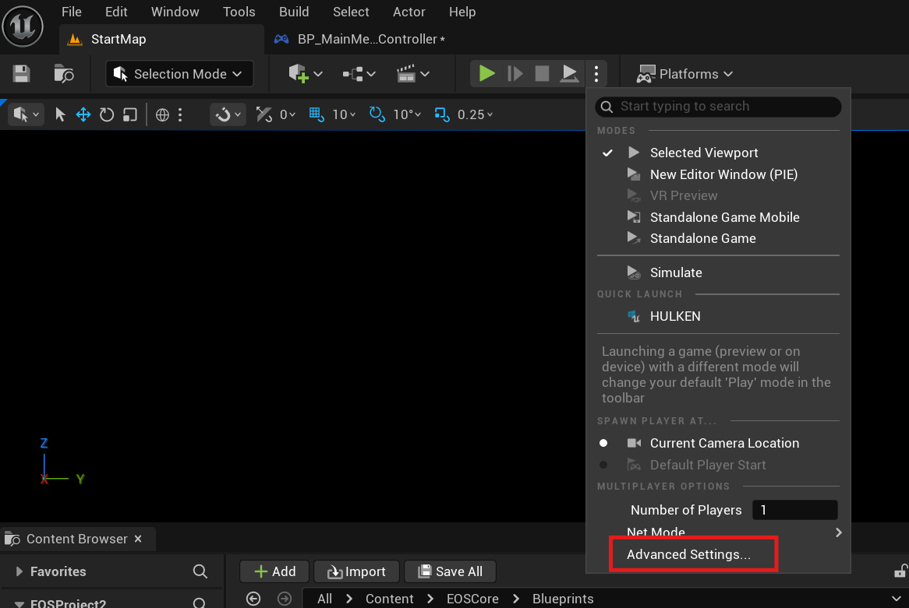
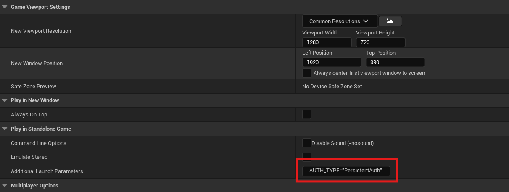
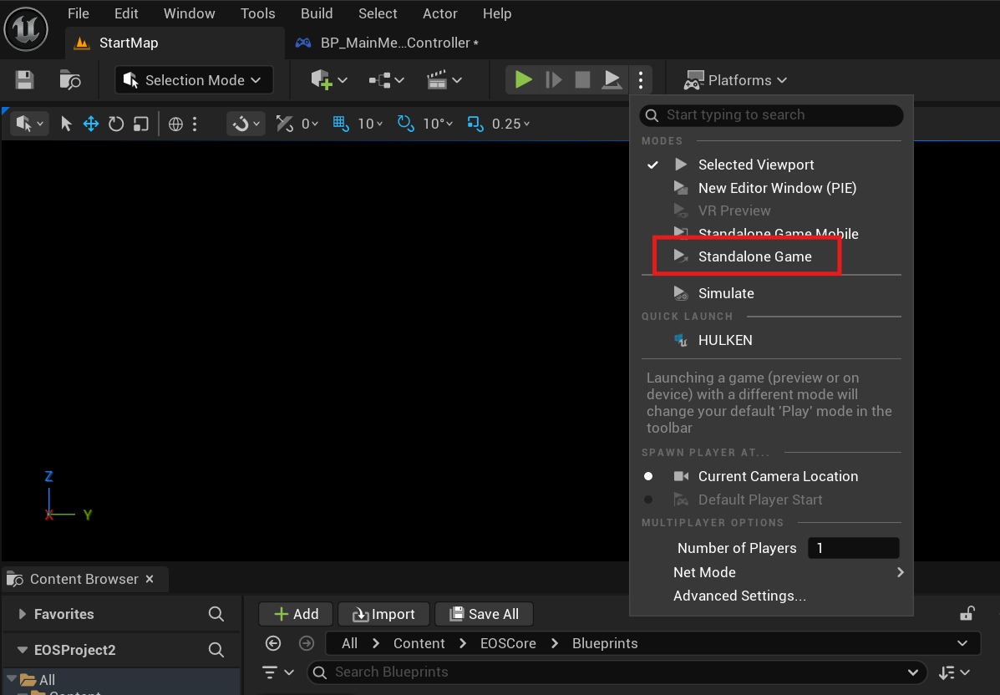
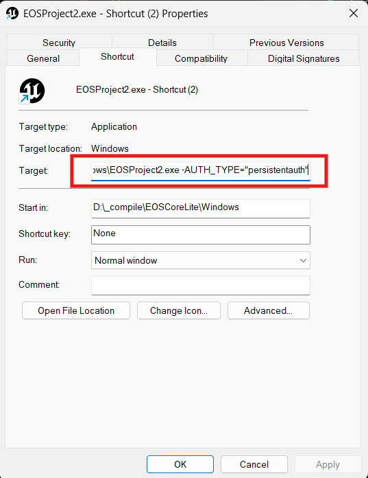

# Autologin

This guide explains how to implement automatic login functionality in your Unreal Engine game using the **Autologin** node provided by the **EOSCore** plugin. The node handles authentication parameters for standalone instances, enabling seamless login without manual user input.

## Prerequisites
- **EOSCore Lite** plugin installed and enabled in your Unreal Engine project.
- Unreal Engine **5.6** (additional versions may be supported as the plugin develops).
- An Epic Online Services (EOS) developer account with a configured **Product ID** and **Client Credentials**.
- A configured `DefaultEngine.ini` file with EOS settings (refer to [EOSCore Setup Documentation](https://eoscore.dev/docs)).

## Using the Autologin Node
The **Autologin** node simplifies authentication by processing launch parameters passed to a standalone instance of your game. This enables automatic login using methods like `accountportal` or `persistentauth`.


### Steps
1. **Add the Autologin Node**:
   - In your game logic (e.g., Game Instance or Player Controller Blueprint), add the **Autologin** node.
   - Execute the node during game initialization to attempt automatic authentication.

2. **Configure Launch Parameters**:
   - Open **Project Settings** > **Advanced Settings** > **Additional Launch Parameters**.
   - Add authentication parameters, such as:
     ```
     -AUTH_TYPE="accountportal"
     -AUTH_TYPE="persistentauth"
     ```

   

   

3. **Launch a Standalone Instance**:
   - Run the game as a **Standalone Instance** from the Unreal Editor (Play-in-Editor, or PIE, does not support launch parameters).
   - Alternatively, package the project and pass parameters via a shortcut or command line.

   

   

### Persistent Authentication Notes
- The `persistentauth` method requires a prior successful login via `accountportal` to store credentials.
- Ensure players have logged in at least once using `accountportal` before relying on `persistentauth`.

## Example Workflow
1. Add the **Autologin** node to your **Game Instance** Blueprint’s `Init` event.
2. Configure `DefaultEngine.ini` with your EOS **Product ID** and **Client Credentials**.
3. Set the launch parameter `-AUTH_TYPE="accountportal"` in **Project Settings** for testing.
4. Launch a standalone instance to test automatic login.
5. After a successful `accountportal` login, switch to `-AUTH_TYPE="persistentauth"` for subsequent logins.

## Notes
- **Standalone Requirement**: The **Autologin** node only works in standalone instances or packaged builds. Play-in-Editor (PIE) does not support launch parameters.
- **Testing**: Test in a standalone instance to verify authentication behavior. Use Sandbox Mode in your EOS Developer Portal for safe testing.