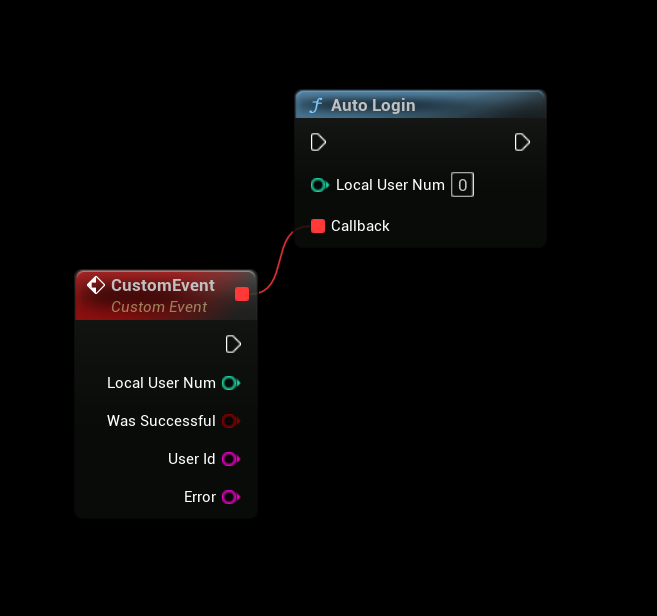

# Authenticating via Epic Launcher with EOSCore

This guide explains how to authenticate users who launch your Unreal Engine game through the **Epic Games Launcher** using the **Autologin** node provided by the **EOSCore** plugin. The node communicates with the **OnlineSubsystemEOS** to handle authentication parameters passed by the Epic Launcher, ensuring seamless login integration.

## Prerequisites
- **EOSCore Lite** plugin installed and enabled in your Unreal Engine project.
- Unreal Engine **5.6** (additional versions may be supported as the plugin develops).
- An Epic Online Services (EOS) developer account with a configured **Product ID**, **Client Credentials**, and **Artifact Name**.
- Properly configured `DefaultEngine.ini` file with EOS settings (refer to [EOSCore Setup Documentation](https://eoscore.dev/docs)).
- Your game published or configured in the Epic Games Developer Portal with a valid **Artifact Name**.

## Using the Autologin Node
The **Autologin** node enables automatic authentication for users launching the game via the Epic Games Launcher. It processes parameters passed by the launcher to authenticate with Epic Online Services.

### Steps
1. **Add the Autologin Node**:
   - In your game logic (e.g., Game Instance or Player Controller Blueprint), add the **Autologin** node.
   - Execute the node during game initialization to authenticate users based on Epic Launcher parameters.

2. **Configure the Artifact Name**:
   - In the Epic Games Developer Portal, navigate to **Your Product** > **Artifacts and Binaries** to find your application’s **Artifact Name**.
   - Ensure the **Artifact Name** is correctly set in your `DefaultEngine.ini` file under the EOS configuration section. (or in Project Settings, as seen in the image below), Failing to set this correctly will cause the application to crash on launch.

   

3. **Test Authentication**:
   - Launch the game through the Epic Games Launcher.
   - The **Autologin** node will use the launcher’s parameters to authenticate the user with Epic Online Services.

## Example Workflow
1. Add the **Autologin** node to your **Game Instance** Blueprint’s `Init` event.
2. Verify that the **Artifact Name**, **Product ID**, and **Client Credentials** are correctly set in `DefaultEngine.ini`.
3. Package your game or run a standalone instance via the Epic Games Launcher.
4. Test the authentication flow to ensure the user is logged in automatically without manual input.

## Notes
- **Artifact Name Requirement**: The **Artifact Name** must match the one defined in the Epic Games Developer Portal. Incorrect configuration will result in a crash on launch.
- **Epic Launcher Dependency**: This authentication method only works when the game is launched via the Epic Games Launcher. For other launch methods, consider using alternative authentication flows (e.g., [Autologin with Launch Parameters](./auth_autologin.md)).
- **Testing**: Use the Epic Games Launcher in a development environment to test authentication. Enable Sandbox Mode in the EOS Developer Portal for safe testing.
- **Error Handling**: Implement logic to handle authentication failures (e.g., invalid credentials or network issues) and provide clear feedback to players via the UI.