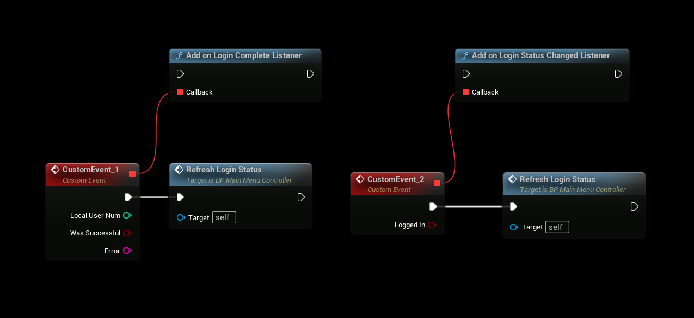

import Tabs from '@theme/Tabs';
import TabItem from '@theme/TabItem';

# Epic Online Services (EOS) Authentication Overview

The **Epic Online Services (EOS) SDK** provides a robust and secure authentication system for managing user login and identity in games and applications. With the **EOSCore** plugin, you can integrate this system into your Unreal Engine project to handle user authentication seamlessly, supporting various methods such as Epic Launcher login, account portal, and persistent authentication.

## Key Features
- **Secure Authentication**: Leverage EOS to authenticate users securely via Epic Games accounts or other supported methods.
- **Flexible Integration**: Use Blueprint or C++ to implement authentication workflows in your project.
- **Event Listeners**: Utilize callback nodes to handle authentication events and update game states or UI dynamically.
- **Cross-Platform Support**: Works across platforms supported by Unreal Engine and EOS.

For detailed implementation details, refer to the [EOS SDK Authentication Documentation](https://dev.epicgames.com/docs/services/en-US/api-ref/interfaces/auth/).

## Authentication Listeners
EOSCore provides two key listener nodes to manage authentication workflows when using the **OnlineSubsystemEOS** (e.g., via Autologin, Account Portal, or other methods). These listeners allow you to respond to authentication events, such as successful logins or failures, and update your game’s UI or logic accordingly.

### Listener Nodes
1. **OnLoginComplete**: Triggered when an authentication attempt succeeds or fails. Use this to update the UI, transition to a game state, or handle errors.
2. **OnLoginStatusChanged**: Fired when the user’s login status changes (e.g., logged in, logged out, or network issues). Useful for real-time UI updates or session management.

### Example Use Case
- Add the **OnLoginComplete** node to your **Game Instance** Blueprint to detect when a user successfully logs in via the Epic Games Launcher.
- Use the **OnLoginStatusChanged** node to refresh the UI if the user’s session expires or disconnects.

### Steps
1. In your Blueprint (e.g., Game Instance or Player Controller), add the **OnLoginComplete** and **OnLoginStatusChanged** nodes.
2. Connect these nodes to your game logic to handle authentication outcomes (e.g., show a "Logged In" message or redirect to a login screen on failure).
3. Test the listeners with your chosen authentication method (see supported methods below).

## Supported Authentication Methods
EOSCore supports multiple authentication methods, detailed in the following guides:
- [Autologin with Launch Parameters](./auth_autologin.md): Automatically authenticate users using command-line parameters.
- [Epic Launcher Authentication](./auth_launcher.md): Authenticate users launching the game via the Epic Games Launcher.
- Additional methods (e.g., Account Portal, Persistent Authentication) are accessible via the sidebar.

## Prerequisites
- **EOSCore Lite** plugin installed and enabled in your Unreal Engine project.
- Unreal Engine **5.6** (additional versions may be supported as the plugin develops).
- An Epic Online Services developer account with a configured **Product ID** and **Client Credentials**.
- Properly configured `DefaultEngine.ini` file with EOS settings (refer to [EOSCore Setup Documentation](../getting-started/configuring.md)).