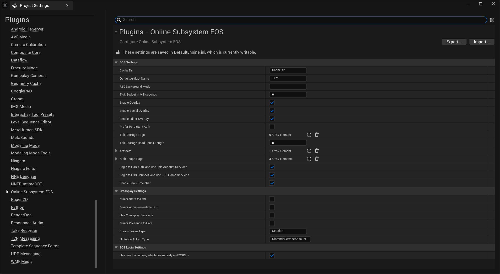

import Tabs from '@theme/Tabs';
import TabItem from '@theme/TabItem';

# Configuring the Plugin

This tutorial will guide you through configuring the OnlineSubsystemEOS in your project's DefaultEngine.ini file to work with Epic Online Services.

## Prerequisites

- EOSCore Lite plugin installed and enabled
- Epic Online Services application created in the Epic Games Developer Portal
- Your EOS Product ID, Sandbox ID, Deployment ID, and Client credentials

## Locating DefaultEngine.ini

### Step 1: Find Your Project's Config Folder
1. Navigate to your Unreal Engine project directory
2. Open the **Config** folder
3. Locate the **DefaultEngine.ini** file

**File path:** `YourProject/Config/DefaultEngine.ini`

### Step 2: Backup Your Configuration
1. Create a copy of **DefaultEngine.ini** before making changes
2. Name it something like **DefaultEngine_backup.ini**
3. This allows you to restore the original configuration if needed

## Basic OnlineSubsystemEOS Configuration

### Step 3: Add Online Subsystem Settings

Open **DefaultEngine.ini** in a text editor and add the following sections:

```ini
[OnlineSubsystem]
DefaultPlatformService=EOS

[OnlineSubsystemEOS]
bEnabled=true

[/Script/OnlineSubsystemEOS.EOSSettings]
CacheDir=CacheDir
DefaultArtifactName=Client
TickBudgetInMilliseconds=0
bEnableOverlay=true
bEnableSocialOverlay=true
bEnableEditorOverlay=true
bShouldEnforceBeingLaunchedByEGS=false
TitleStorageReadChunkLength=0
+Artifacts=(ArtifactName="Client",ClientId="your_client_id_here",ClientSecret="your_client_secret_here",ProductId="your_product_id_here",SandboxId="your_sandbox_id_here",DeploymentId="your_deployment_id_here",EncryptionKey="")
```

### Step 4: Replace Placeholder Values

Replace the following placeholder values with your actual EOS credentials:

- **`your_client_id_here`** - Your application's Client ID from EOS Developer Portal
- **`your_client_secret_here`** - Your application's Client Secret from EOS Developer Portal  
- **`your_product_id_here`** - Your EOS Product ID
- **`your_sandbox_id_here`** - Your EOS Sandbox ID
- **`your_deployment_id_here`** - Your EOS Deployment ID

## Advanced Configuration Options

### Step 5: Optional Advanced Settings

You can customize additional settings based on your needs:

```ini
[/Script/OnlineSubsystemEOS.EOSSettings]
# Cache and Performance
CacheDir=CacheDir
TickBudgetInMilliseconds=0
TitleStorageReadChunkLength=0

# Overlay Settings
bEnableOverlay=true
bEnableSocialOverlay=true
bEnableEditorOverlay=true

# Launch Requirements
bShouldEnforceBeingLaunchedByEGS=false

# Platform-specific settings
bUseEAS=true
bUseEOSConnect=true
bMirrorStatsToEOS=true
bMirrorAchievementsToEOS=true
bMirrorPresenceToEAS=true
```

### Configuration Options Explained:

- **`bEnableOverlay`** - Enables the EOS overlay interface
- **`bEnableSocialOverlay`** - Enables social features in overlay
- **`bEnableEditorOverlay`** - Allows overlay to work in editor
- **`bShouldEnforceBeingLaunchedByEGS`** - Requires launch through Epic Games Store
- **`bUseEAS`** - Use Epic Account Services for authentication
- **`bUseEOSConnect`** - Use EOS Connect for cross-platform features
- **`bMirrorStatsToEOS`** - Synchronize stats with EOS backend
- **`bMirrorAchievementsToEOS`** - Synchronize achievements with EOS
- **`bMirrorPresenceToEAS`** - Show presence status through Epic Account Services

## Verification and Testing

### Step 8: Verify Configuration

1. Save the **DefaultEngine.ini** file
2. Close and reopen Unreal Engine
3. Open your project
4. Check the **Output Log** for any EOS-related errors
5. Look for successful EOS initialization messages

## Example Complete Configuration

Here's a complete example DefaultEngine.ini section:

```ini
[OnlineSubsystem]
DefaultPlatformService=EOS

[OnlineSubsystemEOS]
bEnabled=true

[/Script/OnlineSubsystemEOS.EOSSettings]
CacheDir=CacheDir
DefaultArtifactName=Client
TickBudgetInMilliseconds=0
bEnableOverlay=true
bEnableSocialOverlay=true
bEnableEditorOverlay=true
bShouldEnforceBeingLaunchedByEGS=false
bUseEAS=true
bUseEOSConnect=true
bMirrorStatsToEOS=true
bMirrorAchievementsToEOS=true
bMirrorPresenceToEAS=true
TitleStorageReadChunkLength=0
+Artifacts=(ArtifactName="Client",ClientId="xyz123...",ClientSecret="abc456...",ProductId="1234567890abcdef1234567890abcdef",SandboxId="1234567890abcdef1234567890abcdef12345678",DeploymentId="1234567890abcdef1234567890abcdef12345678",EncryptionKey="")
```

## Project Settings

Additional settings can be found in Project Settings > Online Subsystem EOS



## Security Notes

- **Never commit** your actual Client Secret to version control
- Keep your EOS credentials secure and don't share them publicly
- Use different Sandbox IDs for development, testing, and production environments

## Next Steps

After configuring OnlineSubsystemEOS:
- Test authentication and login flows