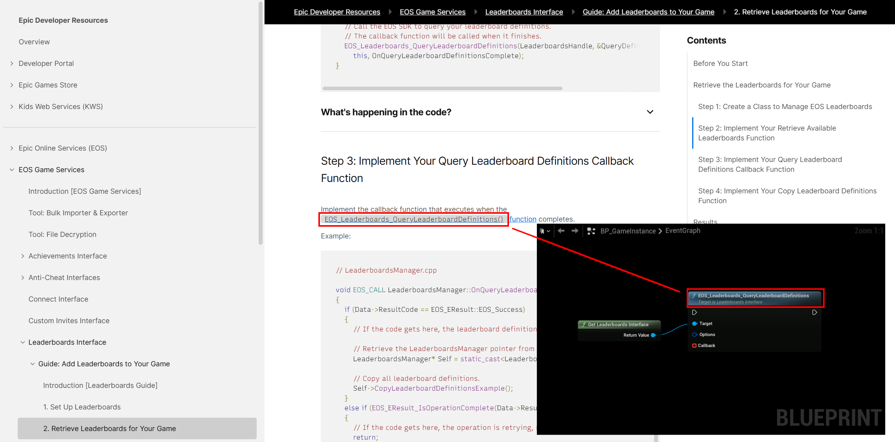
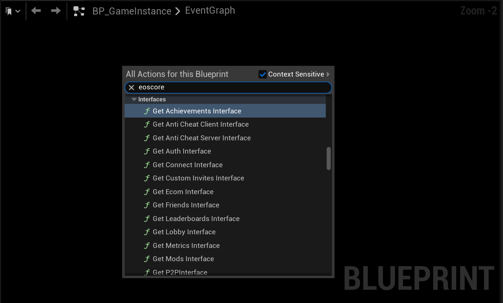
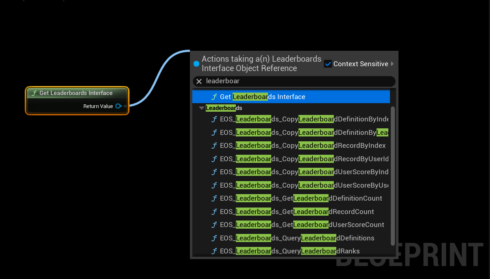
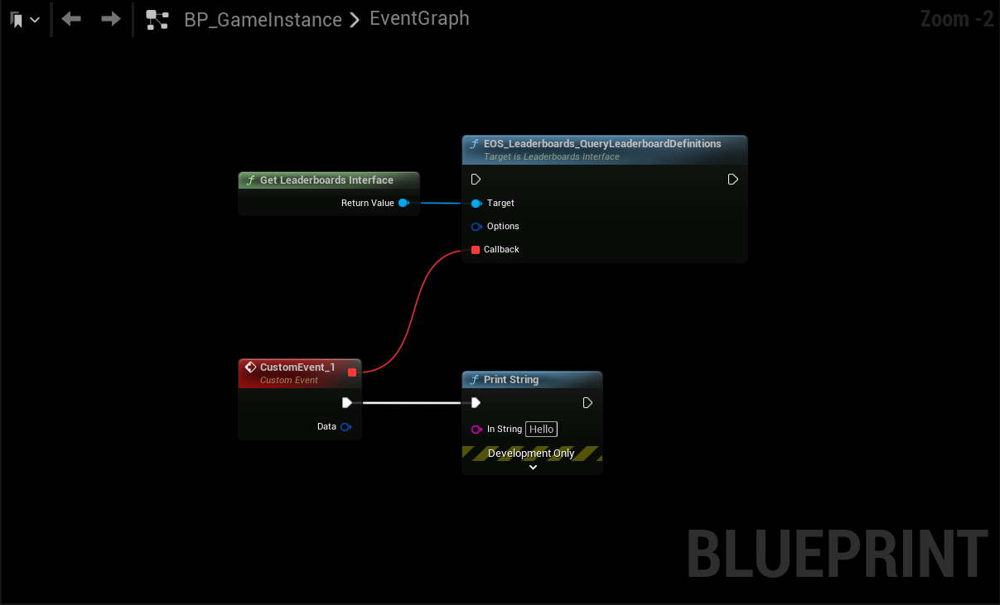

import Tabs from '@theme/Tabs';
import TabItem from '@theme/TabItem';

# Using the Plugin

This guide provides practical examples of how to use the EOSCore Lite plugin in your Unreal Engine project using Blueprints.

## Prerequisites

- EOSCore Lite plugin installed and enabled
- OnlineSubsystemEOS configured in DefaultEngine.ini
- Valid EOS credentials configured
- Basic understanding of Blueprint visual scripting

## Best Practices and Tips
- All EOSCore nodes mirror the naming conventions of the official Epic Online Services (EOS) documentation, ensuring consistency [found here](https://dev.epicgames.com/docs/game-services/leaderboards). 

To find nodes:
1. Open a Blueprint graph.
2. Right-click in the graph and type "eoscore" to filter for EOSCore-specific nodes.
3. Select the desired interface or function (e.g., `EOSCore Leaderboards`, `EOSCore Friends`).

### Blueprint Interfaces
EOSCore provides interfaces for various EOS features, such as Leaderboards, Friends, Presence, and Achievements. These can be accessed via:
- **Context Menu**: Right-click in any Blueprint graph and search for "eoscore" to view all available interfaces.
- **Common Interfaces**:
  - `EOSCore Leaderboards`: Manage leaderboard data and rankings.
  - `EOSCore Friends`: Handle friend lists and status updates.
  - `EOSCore Achievements`: Unlock and query player achievements.
  - `EOSCore Sessions`: Create and manage multiplayer sessions.

### Blueprint Functions
Each interface contains specific functions. For example, the `Leaderboards` interface includes:

- `QueryLeaderboardRanks`: Retrieves leaderboard rankings.
- `GetLeaderboardDefinition`: Fetches leaderboard metadata.
- `SubmitLeaderboardScore`: Submits a player's score to a leaderboard.

### Async Functions
Many EOSCore functions are asynchronous to prevent blocking the game thread. These functions require a callback event:

1. Drag off the `Callback` pin of the async node.
2. Search for "custom" and create a custom event with a matching signature.
3. Handle both success and failure outcomes in the callback.

### Error Handling
- Always implement both success and failure callbacks
- Log error messages for debugging
- Provide user-friendly error messages in UI
- Implement retry mechanisms for network operations

### Performance Considerations
- Cache frequently accessed data (friends list, achievements)
- Implement loading states for network operations
- Use async operations to prevent UI freezing
- Limit the frequency of certain API calls

### UI/UX Recommendations
- Show loading indicators during network operations
- Provide feedback for all user actions
- Handle offline scenarios gracefully
- Implement proper session cleanup on game exit

### Security Notes
- Never expose sensitive credentials in blueprints
- Validate user inputs before sending to EOS
- Implement proper authentication checks
- Use secure communication for sensitive data

